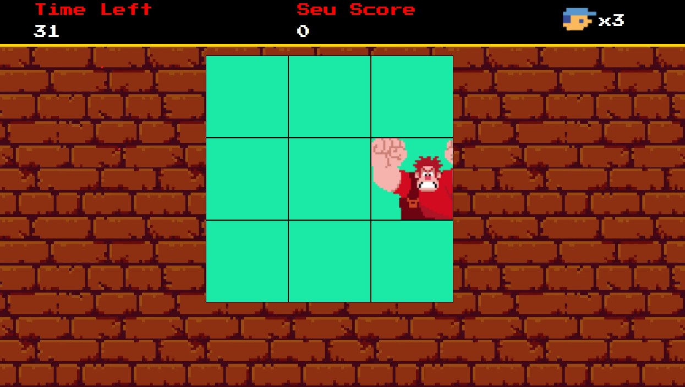

# Ri Happy - Front-end do Zero #1 | Detona Ralph

Bem-vindo ao repositório do jogo Detona Ralph, projeto inspirado no filme! 🚀

## 🕹️ Sobre o Projeto:
O Detona Ralph é um jogo dinâmico no qual o objetivo é acertar o alvo certo (janelas com o Ralph), o mesmo foi desenvolvido durante o Bootcamp **Ri Happy - Front-end do Zero**, junto com a **Digital Innovation One (DIO)**!

## ⚙️ Tecnologias aplicadas:

## 🖥 Preview:

  

Divirta-se quebrando tudo! 💪🎯